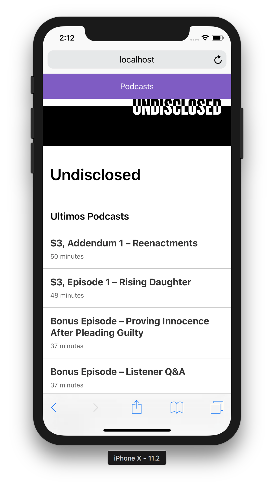

# App de Podcasts

App de Podcasts integrada con la API de AudioBoom usando Next.JS

[Ver la aplicacion](https://podcast-dbngfxfsaz.now.sh)

## ¿Cómo funciona?

Requiere Node.JS 8+

* `npm install` para instalar las dependencias.
* `npm run dev` para el entorno de desarrollo.
* `npm run build && npm start` para el entorno de producción.

## Licencia

MIT